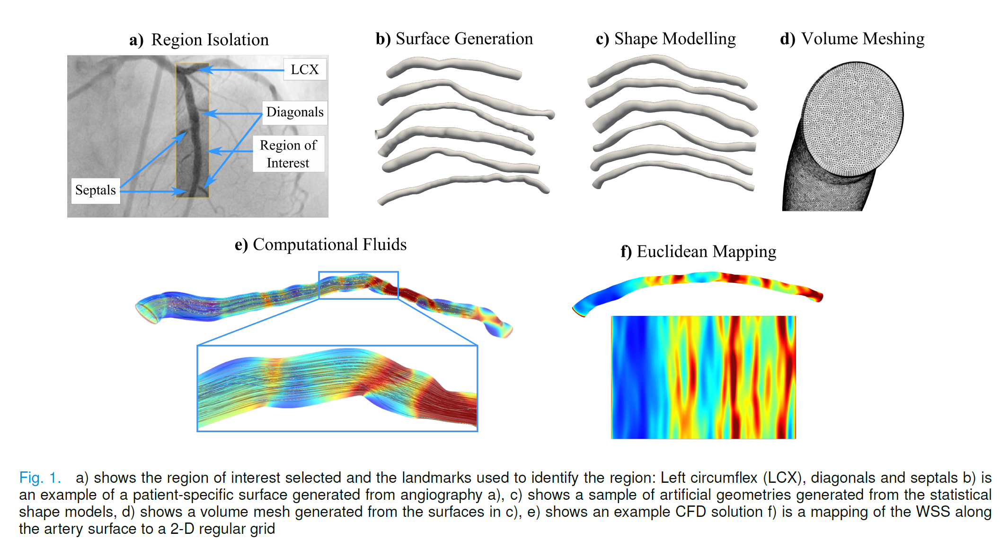
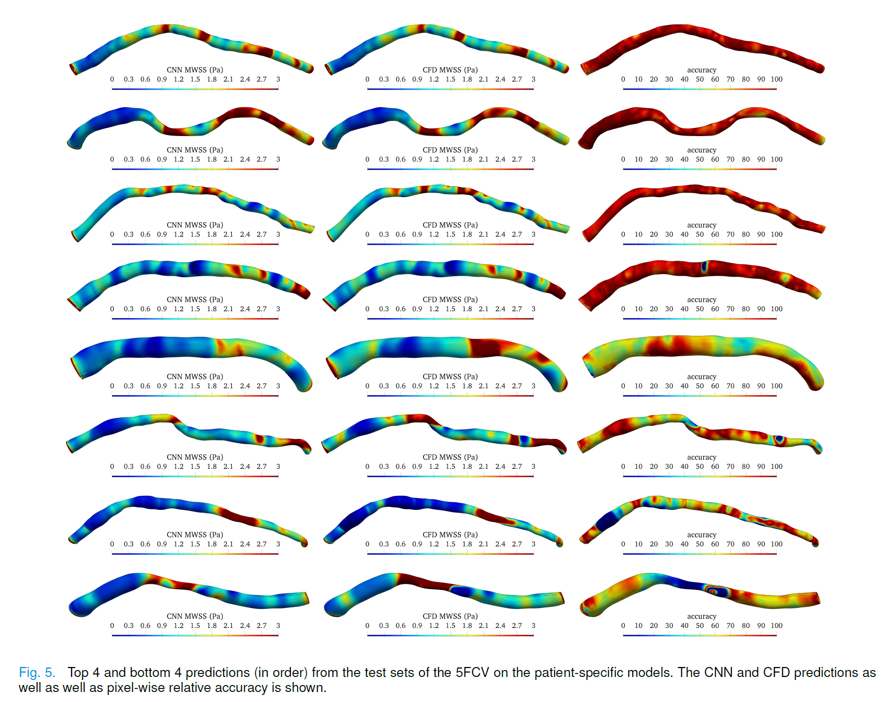

# Convolutional Neural Networks for Wall Shear Stress Prediction

Deep Convolutional Neural Networks for Real-Time Patient-Specific Wall Shear Stress
Estimation, most recent draft can be found [here](https://github.com/Chr1sC0de/myTorch/tree/master/Drafts/CNN_WSS_Predictions.pdf)

Current research involves the automatic delineation of the artery lumen as well as
the analysis of artery wall shear stress using deep learning. The work is currently
unpublished and is within the drafting stages. Bellow includes the paper abstract
as well as several figures. Can be found in the drafts folder.

Abstract—Blood flow exerts stresses on the coronary artery wall.Wall shear stress
(WSS), the parallel component of stress, when abnormally low ( <1Pa) may promote the
pathological development of cholesterol-laden plaque, resulting in arterial
narrowing. Accurately determining WSS helps to inform clinicians about plaque
progression. Nevertheless, WSS is difficult to measure directly but can be estimated
accurately by solving the governing equations of fluid motion (the Navier-Stokes
Equations). Solving these complex equations can be both time consuming and
computationally expensive to perform (> 1hr). Deep Learning (DL) is capable of
learning patterns directly from data providing an avenue for real-time prediction of
WSS. Thus, in this paper, we outline a method which employs popular DL models for
their use in the prediction of WSS from artery models generated from coronary
angiography. The best performing model was able to predict the WSS in under 0.29s
with an average coefficient of determination R2> 75% compared to high resolution CFD
simulations.




Installation
------------

To install the requirements

First install pytorch

````powershell
pip install torch===1.4.0 torchvision===0.5.0 -f https://download.pytorch.org/whl/torch_stable.html
````

````powershell
python -m pip install -r requirements.txt
````

To install the main package in debug mode

````powershell
python -m pip install -e .
````

To install the main package in release mode

````powershell
python -m pip install .
````

to view the vtk files download and install paraview https://www.paraview.org/.

Data
----

Data for training and testing is assumed to be contained in the `DATA` folder in the top directory. The data is stored in two formats, .npz and .vtk. the vtk files can be easily viewed in paraview and show the original meshes as wells as the meshes parameterized in 2D. The npz files contain the tensor data with dimensions (channels, height, width). The data files are quite large and are unable to fit on the free version of github, however they can be obtained directly from the following link,

https://unimelbcloud-my.sharepoint.com/:f:/g/personal/cmamon_student_unimelb_edu_au/Epx-e_s_Zj1HtlF88MOmXF4B1MJMpbBEbQ7Zu1gVJizOLA?e=VYqjIn.

Running Examples
----------------

Examples are stored in the `Training_Examples` directory. At the moment only the examples for predicting WSS are supplied. Internal field predictions will be added at a later date once the paper is completed(accuracy may vary from machine to machine). To run an example, in the terminal,

````
cd Training_Examples/WSSPrediction/<case_folder>
python train.py
````
